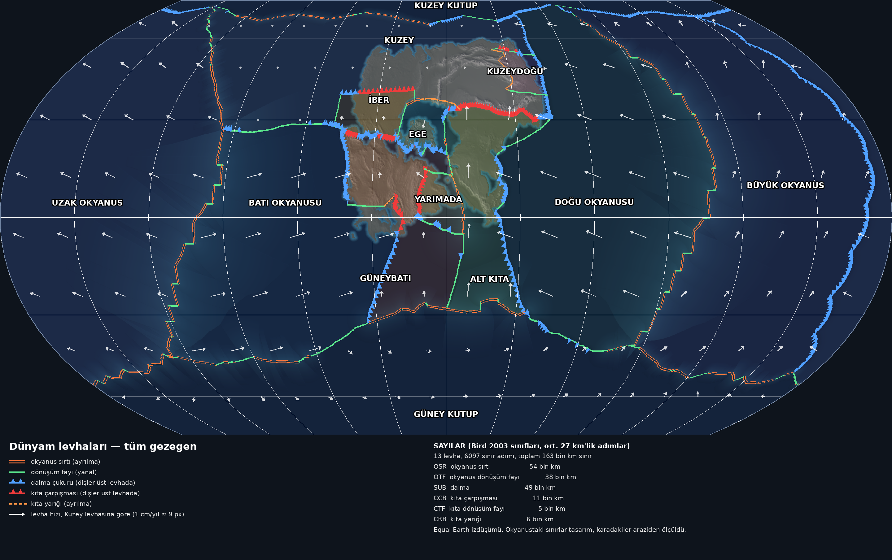

# Dünyam levha tektoniği — özet

Bu belge kendi başına okunacak biçimde yazıldı (başka bir kişi ya da yapay zekâ sohbeti için). Aynı bilgi makine için `ozet.json`'da. Hikâyenin tamamı `HIKAYE.md`'de, kararların tarihçesi `../TEKTONIK.md`'de. Belge `tektonik/ozet.py` ile modelden üretilir; elle düzenleme, betiği koş.

## 1. Kısaca

Dünyam kurgusal bir gezegen: yarıçap 6371 km, gün 15 saat, eksen eğikliği 28°. Tek bir kıtası var (yaklaşık 60°K ile 7°G, 47°B ile 43°D arası); gerisi okyanus. Kıta yedi parçadan oluşur ve bugün iki çarpışma etkindir: 3, 2'nin altına giriyor (Mor Sıradağları); 5, 4'ün altına giriyor (Sarı Sıradağları). 3 milyon yıl önce 1 ile 4 arasındaki boğaz Köprü Kıstağı ile kapandı. Eski hikâyenin adları (Duvar, Alt Kıta, İber, Ege, Yarımada, Güneybatı, And tipi batı çarpışması) geçersizdir.

## 2. Okuma kuralları

- Koordinat: enlem kuzey +, boylam doğu + (−180..180), derece.
- Hız: cm/yıl, **Kuzey Levhası sabit** kabul edilir; diğer hızlar ona göredir (sahibin `kaynak/levhalar_hikaye.json`'u).
- Kıta levhaları (1-7) sahibin levha kimliği görüntüsünden kayıtla enlem ve boylama çevrildi. Kıta ile uzak sırtlar arasındaki okyanus en yakın kıta levhasına verildi (edilgen kenar). Batı Okyanusu, Kutup ve Güney Okyanusu levhaları hikâyede yer tutucu; yerleri atlasın eski gezegen ölçekli modelinden (sırtlar aynı), Büyük Okyanus Levhası yalnız atlasta var.
- Sınır türü elle yazılmadı: her ~55 km'lik sınır adımında iki levhanın göreli hızından hesaplandı (Bird 2003, PB2002 ölçütü): göreli hız sınıra 20°'den yakınsa **yanal**, değilse **yaklaşma** ya da **ayrılma**; iki yanı denizse okyanusal, değilse kıtasal. Hikâyedeki amaçlanan türle karşılaştırma bölüm 5'te.
- [tasarım] işaretli sınırlar sahibin görüntüsünde yok: görüntü çerçevesinin dışındaki uzantılar ya da uzak okyanus sınırları.

| kısaltma | anlamı |
|---|---|
| OSR | okyanus sırtı |
| OTF | okyanus dönüşüm fayı |
| OCB | okyanusal yakınlaşma |
| SUB | dalma |
| CRB | kıta yarığı |
| CTF | kıta dönüşüm fayı |
| CCB | kıta çarpışması |
| PAS | hareketsiz |

## 3. Levhalar

| no | levha | tür | kapsam | alan (milyon km²) | kara payı | hareket (Kuzey'e göre) | komşular |
|---|---|---|---|---|---|---|---|
| 1 | Kuzey Levhası | kıta + okyanus | 1, 2 (şerit dahil), 4; Köprü Kıstağı; iç denizin batısı; kuzey, batı ve güney sahanlıkları | 123.6 | %21 | sabit (çerçeve) | Ada Bloğu, Batı Okyanusu Levhası, Doğu Dil Levhası, Doğu Havza Levhası, Doğu Okyanusu Levhası, Güney Okyanusu Levhası, Kutup Levhası, Orta Blok |
| 2 | Doğu Dil Levhası | kıta + okyanus | 3 ve doğu kıyısının önü, Doğu Hendeği'ne kadar | 13.9 | %50 | kuzeye (dönerek) 1.8 cm/yıl | Doğu Havza Levhası, Doğu Okyanusu Levhası, Kuzey Levhası, Orta Blok, Uzun Yarımada Bloğu |
| 3 | Orta Blok | kıta + okyanus | 5 (Sarı Sıradağları'nın doğu şeridi, Sarı Ön Havzası) | 5.0 | %28 | batıya 2.8 cm/yıl | Doğu Dil Levhası, Doğu Havza Levhası, Doğu Okyanusu Levhası, Güney Okyanusu Levhası, Kuzey Levhası, Uzun Yarımada Bloğu |
| 4 | Uzun Yarımada Bloğu | kıta + okyanus | 7 (Uzun Yarımada) | 2.0 | %25 | kuzeybatıya 4.6 cm/yıl | Doğu Dil Levhası, Orta Blok |
| 5 | Ada Bloğu | kıta + okyanus | 6 (iç denizdeki ada) | 2.1 | %42 | güneye 0.7 cm/yıl | Doğu Havza Levhası, Kuzey Levhası |
| 6 | Doğu Havza Levhası | kıta + okyanus | iç denizin doğusu ve güneyi (eski Mor Okyanusu kalıntısı) | 1.9 | %7 | kuzeybatıya 0.8 cm/yıl | Ada Bloğu, Doğu Dil Levhası, Kuzey Levhası, Orta Blok |
| 7 | Doğu Okyanusu Levhası | okyanus | Doğu Hendeği'nin dışındaki okyanus | 78.2 | %0 | batıya 6.5 cm/yıl | Büyük Okyanus Levhası, Doğu Dil Levhası, Güney Okyanusu Levhası, Kutup Levhası, Kuzey Levhası, Orta Blok |
| 8 | Batı Okyanusu Levhası (yer tutucu) | okyanus | batıda, uzak sırtın ötesi | 101.4 | %0 | batıya 2.4 cm/yıl | Büyük Okyanus Levhası, Güney Okyanusu Levhası, Kutup Levhası, Kuzey Levhası |
| 9 | Kutup Levhası (yer tutucu) | okyanus | kuzeyde, uzak sırtın ötesi | 11.6 | %0 | kuzeye 0.6 cm/yıl | Batı Okyanusu Levhası, Büyük Okyanus Levhası, Doğu Okyanusu Levhası, Kuzey Levhası |
| 10 | Güney Okyanusu Levhası (yer tutucu) | okyanus | güneyde, uzak sırtın ötesi | 85.2 | %0 | güneye 1.5 cm/yıl | Batı Okyanusu Levhası, Büyük Okyanus Levhası, Doğu Okyanusu Levhası, Kuzey Levhası, Orta Blok |
| 11 | Büyük Okyanus Levhası (yer tutucu) | okyanus (atlasın kendi levhası) | uzak yarıküre; atlasın gezegen ölçekli okyanus levhası (hikâyede yok) | 85.1 | %0 | kuzeydoğuya 1.8 cm/yıl | Batı Okyanusu Levhası, Doğu Okyanusu Levhası, Güney Okyanusu Levhası, Kutup Levhası |

## 4. Sınırlar

Uzunluğa göre sıralı; 150 km'den kısa parçalar tabloda yok (hepsi `ozet.json`'da). 'yaklaşma' artıysa levhalar birbirine yaklaşıyor, eksiyse ayrılıyor. Aynı levha çifti birden çok parçaya bölünmüşse her parça ayrı satır.

| sınır | arasındaki levhalar | baskın tür (Bird) | uzunluk (km) | yaklaşma (cm/yıl) | üst levha | anlamı |
|---|---|---|---|---|---|---|
| batı okyanus sırtı (uzak) | Batı Okyanusu Levhası / Kuzey Levhası | okyanus sırtı (%91) | 17349 | -1.5 | — | [tasarım] Batı Okyanusu Levhası ile Kuzey Levhası birbirinden ayrılıyor (1.5 cm/yıl). |
| Büyük Okyanus Levhası / Doğu Okyanusu Levhası | Büyük Okyanus Levhası / Doğu Okyanusu Levhası | okyanus sırtı (%86) | 16486 | -4.6 | — | [tasarım] Büyük Okyanus Levhası ile Doğu Okyanusu Levhası birbirinden ayrılıyor (4.6 cm/yıl). |
| Batı Okyanusu Levhası / Büyük Okyanus Levhası | Batı Okyanusu Levhası / Büyük Okyanus Levhası | okyanusal yakınlaşma (%93) | 14662 | +2.7 | Batı Okyanusu Levhası | [tasarım] Büyük Okyanus Levhası, Batı Okyanusu Levhası altına dalıyor (2.7 cm/yıl). |
| güney okyanus sırtı (uzak) | Güney Okyanusu Levhası / Kuzey Levhası | okyanus sırtı (%90) | 11135 | -1.0 | — | [tasarım] Güney Okyanusu Levhası ile Kuzey Levhası birbirinden ayrılıyor (1.0 cm/yıl). |
| Doğu Okyanusu Levhası / Güney Okyanusu Levhası | Doğu Okyanusu Levhası / Güney Okyanusu Levhası | okyanusal yakınlaşma (%53) | 8678 | +2.1 | Güney Okyanusu Levhası | [tasarım] Doğu Okyanusu Levhası, Güney Okyanusu Levhası altına dalıyor (2.1 cm/yıl). |
| kuzey okyanus sırtı (uzak) | Kutup Levhası / Kuzey Levhası | okyanus sırtı (%57) | 7916 | -0.2 | — | [tasarım] Kutup Levhası ile Kuzey Levhası birbirinden ayrılıyor (0.2 cm/yıl). |
| Büyük Okyanus Levhası / Güney Okyanusu Levhası | Büyük Okyanus Levhası / Güney Okyanusu Levhası | okyanus sırtı (%62) | 6911 | -0.7 | — | [tasarım] Büyük Okyanus Levhası ile Güney Okyanusu Levhası birbirinden ayrılıyor (0.7 cm/yıl). |
| Doğu Hendeği | Doğu Dil Levhası / Doğu Okyanusu Levhası | dalma (%82) | 6756 | +4.7 | Doğu Dil Levhası | Doğu Okyanusu Levhası, Doğu Dil Levhası altına dalıyor (4.7 cm/yıl). Hikâyede: dalma (Subduction), Doğu Hendeği: Doğu Okyanusu 3'ün altına dalıyor; Doğu Yay Dağları. |
| 2'nin doğu açığı | Doğu Okyanusu Levhası / Kuzey Levhası | dalma (%80) | 6459 | +3.9 | Kuzey Levhası | Doğu Okyanusu Levhası, Kuzey Levhası altına dalıyor (3.9 cm/yıl). Hikâyede: yanal (Transform), 2'nin doğu açığı. |
| Sarı Sıradağları | Kuzey Levhası / Orta Blok | dalma (%63) | 5191 | +2.6 | Kuzey Levhası | Orta Blok, Kuzey Levhası altına dalıyor (2.6 cm/yıl). Hikâyede: kıta çarpışması (Continental collision), Sarı Sıradağları: 5, 4'ün altına giriyor (Zagros benzeri, 8 MYÖ'den beri). |
| Batı Okyanusu Levhası / Güney Okyanusu Levhası | Batı Okyanusu Levhası / Güney Okyanusu Levhası | okyanus sırtı (%74) | 4418 | -0.5 | — | [tasarım] Batı Okyanusu Levhası ile Güney Okyanusu Levhası birbirinden ayrılıyor (0.5 cm/yıl). |
| Güneydoğu Kanalı | Doğu Dil Levhası / Uzun Yarımada Bloğu | okyanus sırtı (%66) | 3730 | -2.7 | — | Doğu Dil Levhası ile Uzun Yarımada Bloğu birbirinden ayrılıyor (2.7 cm/yıl). Hikâyede: ayrılma (Divergent), Güneydoğu Kanalı: 22 MYÖ'den beri açılan yarık, kuzeyinde okyanus kabuğu (Kızıldeniz benzeri). |
| Kanal fayı | Orta Blok / Uzun Yarımada Bloğu | okyanus dönüşüm fayı (%52) | 3474 | -0.1 | — | Orta Blok ile Uzun Yarımada Bloğu yan yana kayıyor. Hikâyede: yanal (Transform), Kanal fayı: 7, 5'e göre kuzeybatıya kayıyor (Ölü Deniz fayı benzeri). |
| Mor Sıradağları | Doğu Dil Levhası / Kuzey Levhası | kıta çarpışması (%79) | 3445 | +1.4 | Kuzey Levhası | Doğu Dil Levhası, Kuzey Levhası levhasına çarpıyor, altına giriyor (1.4 cm/yıl). Hikâyede: kıta çarpışması (Continental collision), Mor Sıradağları: 3, 2'nin altına giriyor (Himalaya benzeri, 50 MYÖ'den beri). |
| adanın kuzey ve batısı | Ada Bloğu / Kuzey Levhası | okyanus sırtı (%51) | 3117 | -0.2 | — | Ada Bloğu ile Kuzey Levhası birbirinden ayrılıyor (0.2 cm/yıl). Hikâyede: ayrılma (Divergent), adanın kuzey ve batısı: yay ardı gerilmesi, 6 güneye çekiliyor. |
| Büyük Okyanus Levhası / Kutup Levhası | Büyük Okyanus Levhası / Kutup Levhası | okyanusal yakınlaşma (%80) | 3024 | +1.3 | Büyük Okyanus Levhası | [tasarım] Kutup Levhası, Büyük Okyanus Levhası altına dalıyor (1.3 cm/yıl). |
| Doğu Dil Levhası / Doğu Havza Levhası | Doğu Dil Levhası / Doğu Havza Levhası | dalma (%49) | 3009 | +0.2 | Doğu Dil Levhası | Doğu Havza Levhası, Doğu Dil Levhası altına dalıyor (0.2 cm/yıl). Hikâyede: yanal (Transform). |
| Ada Hendeği | Ada Bloğu / Doğu Havza Levhası | dalma (%74) | 1900 | +0.7 | Ada Bloğu | Doğu Havza Levhası, Ada Bloğu altına dalıyor (0.7 cm/yıl). Hikâyede: dalma (Subduction), Ada Hendeği: doğu iç deniz tabanı 6'nın altına dalıyor. |
| Doğu Okyanusu Levhası / Kutup Levhası | Doğu Okyanusu Levhası / Kutup Levhası | okyanusal yakınlaşma (%94) | 1511 | +2.0 | Doğu Okyanusu Levhası | [tasarım] Kutup Levhası, Doğu Okyanusu Levhası altına dalıyor (2.0 cm/yıl). |
| Güneydoğu Kanalı'nın kuzey ucu | Doğu Dil Levhası / Orta Blok | okyanus sırtı (%100) | 1427 | -4.6 | — | [tasarım] Doğu Dil Levhası ile Orta Blok birbirinden ayrılıyor (4.6 cm/yıl). |
| Batı Okyanusu Levhası / Kutup Levhası | Batı Okyanusu Levhası / Kutup Levhası | okyanusal yakınlaşma (%46) | 1319 | -0.1 | Kutup Levhası | [tasarım] Batı Okyanusu Levhası, Kutup Levhası altına dalıyor (0.1 cm/yıl). |
| Doğu Havza Levhası / Orta Blok | Doğu Havza Levhası / Orta Blok | kıta yarığı (%74) | 1284 | -1.3 | — | Doğu Havza Levhası ile Orta Blok birbirinden ayrılıyor (1.3 cm/yıl). Hikâyede: yanal (Transform). |
| Doğu Havza Levhası / Kuzey Levhası | Doğu Havza Levhası / Kuzey Levhası | dalma (%61) | 1196 | +0.5 | Kuzey Levhası | Doğu Havza Levhası, Kuzey Levhası altına dalıyor (0.5 cm/yıl). Hikâyede: yanal (Transform). |
| Batı Okyanusu Levhası / Kutup Levhası | Batı Okyanusu Levhası / Kutup Levhası | okyanus dönüşüm fayı (%67) | 1137 | -0.3 | — | [tasarım] Batı Okyanusu Levhası ile Kutup Levhası yan yana kayıyor. |
| Doğu Havza Levhası / Kuzey Levhası | Doğu Havza Levhası / Kuzey Levhası | kıta yarığı (%47) | 1050 | -0.2 | — | Doğu Havza Levhası ile Kuzey Levhası birbirinden ayrılıyor (0.2 cm/yıl). Hikâyede: yanal (Transform). |
| Batı Okyanusu Levhası / Güney Okyanusu Levhası | Batı Okyanusu Levhası / Güney Okyanusu Levhası | okyanus dönüşüm fayı (%75) | 869 | +0.1 | — | [tasarım] Batı Okyanusu Levhası ile Güney Okyanusu Levhası yan yana kayıyor. |
| Güney Okyanusu Levhası / Orta Blok | Güney Okyanusu Levhası / Orta Blok | okyanus dönüşüm fayı (%100) | 689 | +0.7 | — | [tasarım] Güney Okyanusu Levhası ile Orta Blok yan yana kayıyor. |
| adanın kuzey ve batısı | Ada Bloğu / Kuzey Levhası | dalma (%82) | 617 | +0.7 | Kuzey Levhası | Ada Bloğu, Kuzey Levhası altına dalıyor (0.7 cm/yıl). Hikâyede: ayrılma (Divergent), adanın kuzey ve batısı: yay ardı gerilmesi, 6 güneye çekiliyor. |
| Doğu Havza Levhası / Kuzey Levhası | Doğu Havza Levhası / Kuzey Levhası | dalma (%91) | 594 | +0.5 | Kuzey Levhası | Doğu Havza Levhası, Kuzey Levhası altına dalıyor (0.5 cm/yıl). Hikâyede: yanal (Transform). |
| Doğu Okyanusu Levhası / Orta Blok | Doğu Okyanusu Levhası / Orta Blok | dalma (%100) | 228 | +1.5 | Orta Blok | [tasarım] Doğu Okyanusu Levhası, Orta Blok altına dalıyor (1.5 cm/yıl). |

## 5. Amaçlanan tür ile Bird sınıfı

Sahibin `sinirlar_hikaye.json`'undaki tür ile yeni hızlardan hesaplanan Bird sınıfı, levha çifti başına; yalnız sahibin görüntüsünde çizili kesimler sayıldı ('görüntüde km'), görüntü dışındaki uzantı ayrı. 'uyum' = amaçlanan türe uyan sınıfların uzunluk payı (kıta çarpışmasında CCB ve kıyı kesimindeki SUB uyar). Hikâyenin kuralı: ayrılırsa **tablo esas alınır**, fark not edilir.

| levhalar | amaçlanan | Bird baskın | uyum | görüntüde km | dışarıda km | sınıf payları |
|---|---|---|---|---|---|---|
| Batı Okyanusu Levhası / Kutup Levhası | yanal | — (yer tutucu, çizilmedi) | — | 0 | 2456 | — |
| Batı Okyanusu Levhası / Güney Okyanusu Levhası | yanal | — (yer tutucu, çizilmedi) | — | 0 | 5287 | — |
| Kuzey Levhası / Kutup Levhası | ayrılma | — (yer tutucu, çizilmedi) | — | 0 | 7916 | — |
| Doğu Okyanusu Levhası / Güney Okyanusu Levhası | yanal | — (yer tutucu, çizilmedi) | — | 0 | 8678 | — |
| Kuzey Levhası / Batı Okyanusu Levhası | ayrılma | — (yer tutucu, çizilmedi) | — | 0 | 17349 | — |
| Kuzey Levhası / Doğu Okyanusu Levhası | yanal | dalma | %4 | 5734 | 725 | SUB %78, CCB %12, CRB %6, CTF %4 |
| Doğu Dil Levhası / Doğu Okyanusu Levhası | dalma | dalma | %100 | 4484 | 2271 | SUB %100 |
| Kuzey Levhası / Ada Bloğu | ayrılma | okyanus sırtı | %49 | 3565 | 169 | OSR %45, SUB %29, OTF %19, CRB %5, CCB %3 |
| Kuzey Levhası / Güney Okyanusu Levhası | ayrılma | — (yer tutucu, çizilmedi) | — | 0 | 11135 | — |
| Doğu Dil Levhası / Uzun Yarımada Bloğu | ayrılma | okyanus sırtı | %71 | 3620 | 110 | OSR %68, OTF %24, SUB %3, CRB %3, CTF %2 |
| Doğu Okyanusu Levhası / Kutup Levhası | yanal | okyanusal yakınlaşma | %0 | 109 | 1401 | OCB %100 |
| Kuzey Levhası / Doğu Dil Levhası | kıta çarpışması | kıta çarpışması | %81 | 3445 | 0 | CCB %79, OTF %18, SUB %2, CTF %2 |
| Kuzey Levhası / Orta Blok | kıta çarpışması | kıta çarpışması | %100 | 3738 | 1453 | CCB %51, SUB %49 |
| Kuzey Levhası / Doğu Havza Levhası | yanal | dalma | %21 | 2570 | 270 | SUB %49, CRB %22, CTF %15, OTF %7, CCB %6, OSR %2 |
| Doğu Dil Levhası / Doğu Havza Levhası | yanal | dalma | %25 | 3009 | 0 | SUB %49, CTF %22, OSR %11, CCB %11, CRB %4, OTF %4 |
| Orta Blok / Uzun Yarımada Bloğu | yanal | okyanus dönüşüm fayı | %63 | 3419 | 55 | OTF %52, SUB %13, CTF %11, OSR %10, CRB %10, CCB %5 |
| Ada Bloğu / Doğu Havza Levhası | dalma | dalma | %74 | 1900 | 0 | SUB %74, OTF %26 |
| Orta Blok / Doğu Havza Levhası | yanal | kıta yarığı | %18 | 1284 | 137 | CRB %74, OTF %13, CCB %8, CTF %4 |
| Doğu Dil Levhası / Güney Okyanusu Levhası | ayrılma | — (yer tutucu, çizilmedi) | — | 0 | 0 | — |
| Orta Blok / Güney Okyanusu Levhası | ayrılma | — (yer tutucu, çizilmedi) | — | 0 | 689 | — |
| Doğu Dil Levhası / Orta Blok | ayrılma | okyanus sırtı | %100 | 55 | 1521 | OSR %100 |

## 6. Dağlar ve yer şekilleri (kıta)

En yüksek noktalar araziden ölçüldü (sınırın 300-450 km'si içinde ya da levhanın karasında).

| ad | yer (enlem, boylam) | yükseklik (m) | gerçek benzeri | kökeni |
|---|---|---|---|---|
| Mor Sıradağları | 37.0, 3.8 | 6530 | Kafkas ölçeğinde Himalaya benzeri | 3, 2'nin altına giriyor (50 MYÖ'den beri); arkasında ~1 km'lik Şerit Yaylası. |
| Sarı Sıradağları | 13.0, -13.0 | 6481 | Zagros / Tayvan benzeri | 5, 4'ün altına giriyor (8 MYÖ'den beri); genç, dik, en yüksek güney orta kesim. |
| Doğu Yay Dağları | -0.3, 20.5 | 896 | And benzeri yay | Doğu Okyanusu, Doğu Hendeği'nde 3'ün altına dalıyor. |
| Uzun Yarımada sırtı | 7.1, -3.0 | 5143 | Ölü Deniz fayı kıyısı | 7, 5'e bastırarak kuzeybatıya kayıyor; dar, dik sırt. |
| İç denizdeki ada (6) | 27.0, -6.9 | 4811 | Ege / Tiren benzeri | Yay ardı gerilmesi: parmak biçimli horst ve grabenler; Ada Hendeği güneyinde. |
| Köprü Kıstağı | 25.2, -27.7 | 400 | Panama benzeri | 3 MYÖ'de 1 ile 4 arasındaki boğazı kapattı; 80-400 m. |

## 7. Tarih (eskiden yeniye)

Ayrıntı ve tek tek olaylar `HIKAYE.md`'de.

1. **3400-2500 MYÖ**: Kalkanların doğuşu: Ak Kalkan (1'in kuzeyi), Boz Kalkan (2'nin doğusu), Kır Çekirdeği (2'nin batısı), Kızıl Kalkan (3'ün ortası).
2. **2100-1700 MYÖ**: Kaynak orojenleri: Kır Çekirdeği ile Boz Kalkan birleşir; 2'nin içi tek parça olur.
3. **1150-750 MYÖ**: İlk Birlik süper kıtası; 1'in batısında Ulu Dağlar. Parçalanınca 1 ile 2 arasında Ata Okyanusu açılır.
4. **750-520 MYÖ**: İki büyük buzullaşma; Ata Okyanusu kıyılarında kalın çökeller.
5. **520-400 MYÖ**: Mavi orojeni: Ata Okyanusu kapanır, 430 MYÖ'de 1 ile 2 çarpışır (Mavi Dağlar, Kaledonya benzeri).
6. **400-290 MYÖ**: Köz orojeni: Güney Kıtası çarpar, 4'ün temeli kıvrılır; Büyük Birlik. Doğuda Mor Okyanusu kaması açık kalır.
7. **290-200 MYÖ**: İnce Şerit Güney Kıtası'ndan kopup 210 MYÖ'de 2'nin güneyine yapışır; 252 MYÖ Kuzey Tuzakları.
8. **200-130 MYÖ**: Büyük Birlik parçalanır: Batı ve Güney okyanusları açılır; 3, 5 ve 7'yi taşıyan Doğu Parça kuzeye yola çıkar.
9. **130-85 MYÖ**: Makas açılması: 4 ve 6, 1'den ayrılıp ~29° saat yönünde döner; iç denizin batısı açılır, Köprü Dağları başlar.
10. **85-50 MYÖ**: Kuzeye koşu: Doğu Parça yılda ~6,5 cm ilerler; 66 MYÖ Kızıl Basamaklar; Doğu Okyanusu 3'ün altına dalmaya başlar.
11. **50-25 MYÖ**: Mor çarpışması: 3, 2'nin altına girer (Mor Sıradağları, Şerit Yaylası); Tuzak Çanağı kalkar; doğu iç deniz kuşatılır.
12. **25-2,6 MYÖ**: İç deniz evresi: Ada Hendeği, 6 güneye çekilir; 5 kopar ve 8 MYÖ'de 4'e çarpar (Sarı Sıradağları); 7 Kanal Fayı boyunca kayar; 3 MYÖ Köprü Kıstağı kapanır.
13. **2,6-0 MYÖ**: Buzul çağları; bugün iki etkin çarpışma (3 ile 2, 5 ile 4), bir yanal fay, bir yay ardı gerilmesi, bir yarık.

## 8. Açık kararlar

- Uzak okyanus levhalarının (8-11) yeri ve Büyük Okyanus'un hızı tasarım; hikâyede yer tutucu.
- Kaçış Bloğu (2'nin güneydoğu köşesi, doğuya 1,2 cm/yıl) çok küçük olduğu için levha haritasında yok (hikâye kararı).
- Doğu Dil Levhası dönerek ilerliyor (doğu ucu ~2,4, batı ucu ~1,2 cm/yıl); modelde Euler vektörüne 0,3°/My dönme eklendi.

## 9. Dosyalar

- `HIKAYE.md`: hikâyenin tamamı: dönemler, olaylar (sahibin)
- `levha_dunya.png`: tüm gezegen, Equal Earth
- `levha_kure.png`: iki küre görünümü
- `levha_haritasi.png`: kıta ayrıntısı, zaman çizelgesi
- `sinirlar.geojson`: her sınır adımı bir LineString; özellikler: sinir, sol, sag, sinif, ust, yaklasma, yanal, km, goruntude
- `levha_kimlik.png`: kaynak çözünürlüğünde ızgara (4096×2048, satır 0 = 90°K), değer = levha kimliği
- `levhalar.json`: levha alanları, Euler kutupları, amaçlanan türle karşılaştırma
- `kaynak/`: sahibin girdileri (levha_kimlik_8k.png, levhalar_hikaye.json, sinirlar_hikaye.json), 16k kaydı, uzak okyanus levhaları
- `TEKTONIK.md`: kararların tarihçesi (eski hikâye geçersiz işaretli)
